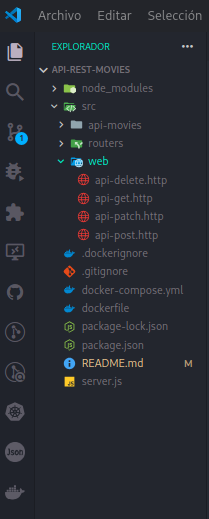
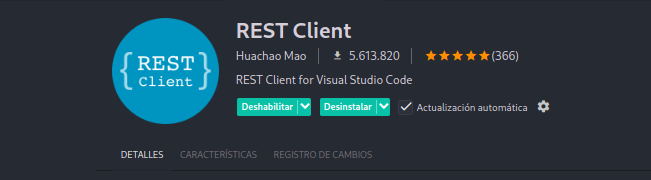

# API REST de Películas 🎥
Esta es una API RESTful desarrollada con Express.js y dockerizada con Docker, que permite gestionar y filtrar películas según distintos criterios.
- Nombre
- Id
- Año de lanzamiento
- Genero

## Caracteristicas
- `Filtrado Eficiente`: filtra las peliculas por `nombre,` `id`, `año,` o `genero`

## Tegnologias
- Node.js
- ExpressJS
- Docker

# Instalacion
clonamos el repositorio
```bash
  git clone https://github.com/UsopKing7/Api-Rest-movies.git
```
acceder a la carpeta clonada 
```bash
  cd Api-Rest-movies
```
# uso 
De forma sin usar docker
```bash
  $ npm install
  $ npm run dev
```
# Usando imagen docker
```bash
  $ docker build -t api-rest-movies .
  $ docker run -p 3000:3000 api-rest-movies
```
- Importante tener docker iniciado

# para poder hacer la filtracion



para poder hacer las filtraciones o `GET` `POST` `DELETE` `PATCH` realiza las peticiones en los archivos `.http`
## Extencion Requerida



## Contribuciones

Las contribuciones son bienvenidas. Si deseas mejorar este proyecto, puedes seguir estos pasos:

1. Haz un fork del repositorio.
2. Crea una rama para tu cambio 
3. Realiza tus cambios y haz commit de ellos 
4. Sube tus cambios a tu fork 
5. Abre un pull request desde tu fork hacia el repositorio original.

## Soporte

Si tienes problemas al utilizar este script o tienes preguntas, no dudes en abrir un **issue** en el repositorio. Nos esforzamos por responder lo antes posible y ayudar a resolver cualquier inconveniente.

## Agradecimientos

Gracias por utilizar este proyecto. Si lo encuentras útil, ¡no dudes en dejar una estrella ⭐ en GitHub!

